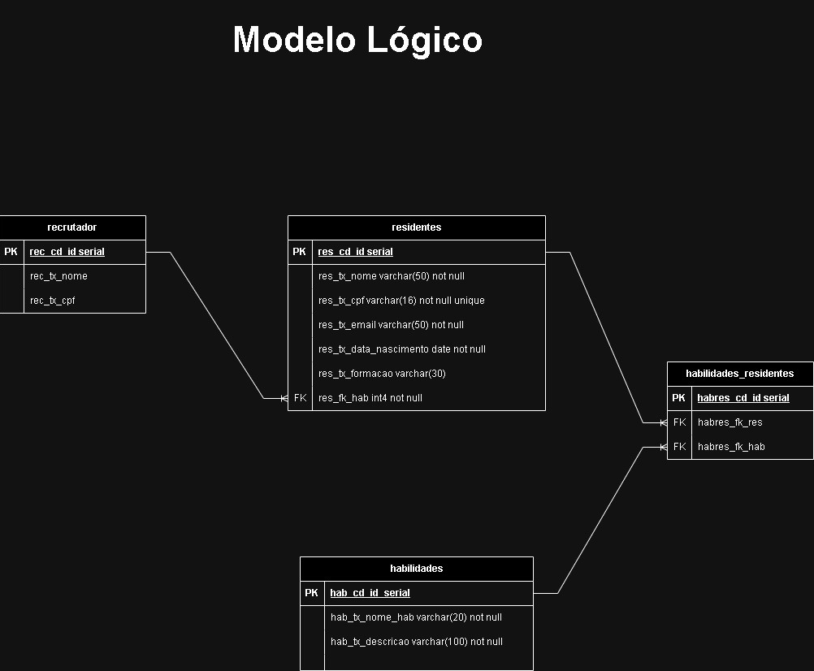

# POO-Serratec

## :detective: Índice

<ul>
    <li>Sobre o Projeto</li>
    <li>Tecnologias utilizadas</li>
    <li>Autores do Projeto</li>
</ul>

## :desktop_computer: Sobre o Projeto

Trabalho Individual da disciplina de Programação Orientada a Objetos, na residência em TIC do Serratec.

## :hammer_and_wrench: Tecnologias utilizadas

- [Spring Tools 4](https://spring.io)
- [GitHub](https://github.com/)

  
  ## Modelo Lógico

## :fountain_pen: Autores

- :boy:  [Gabriel Pimentel](https://github.com/GabrielnPimentel)
